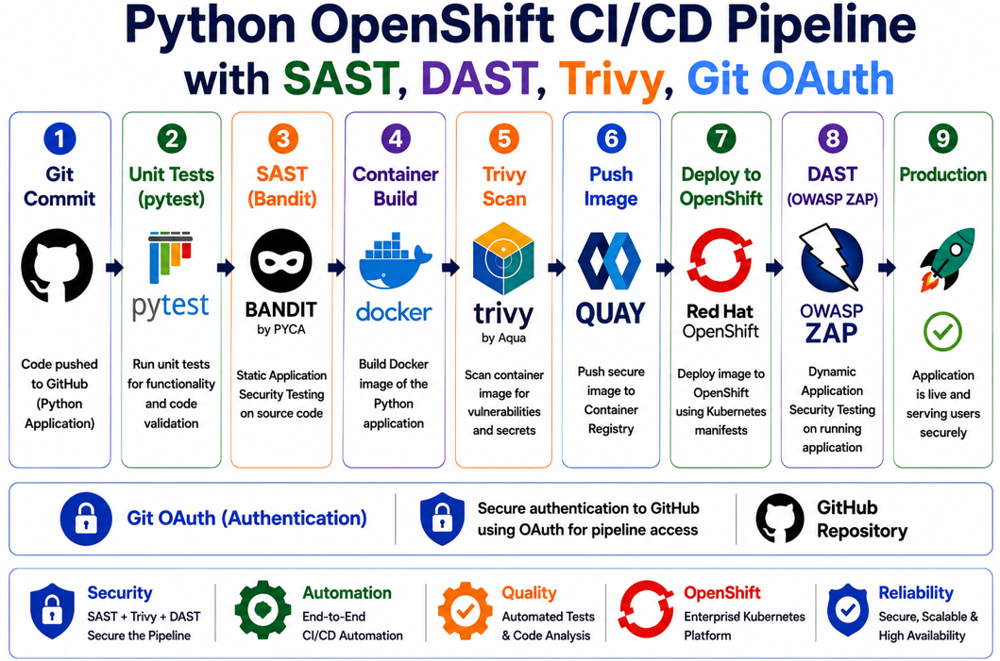
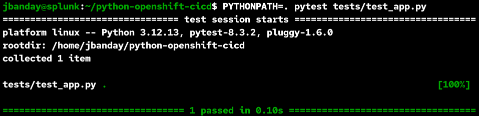
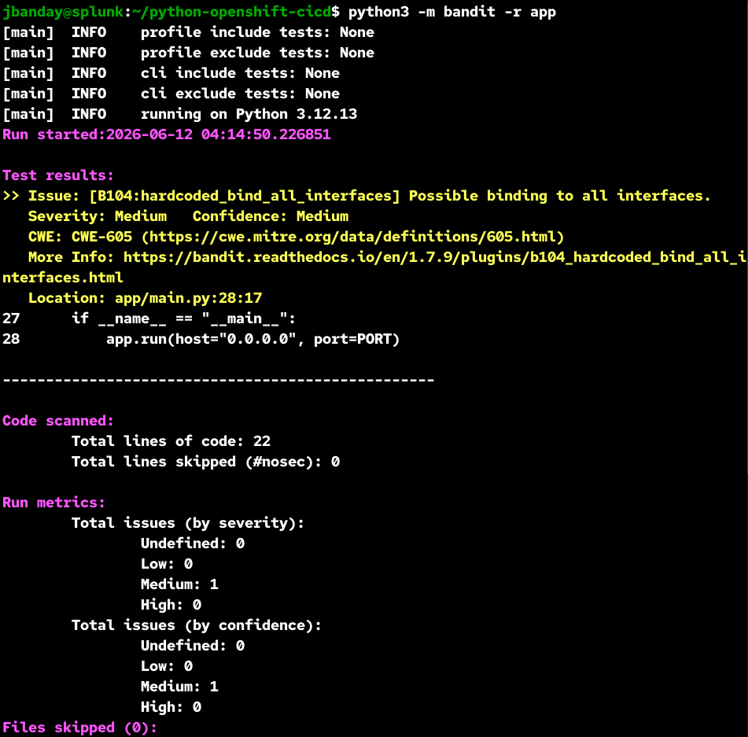
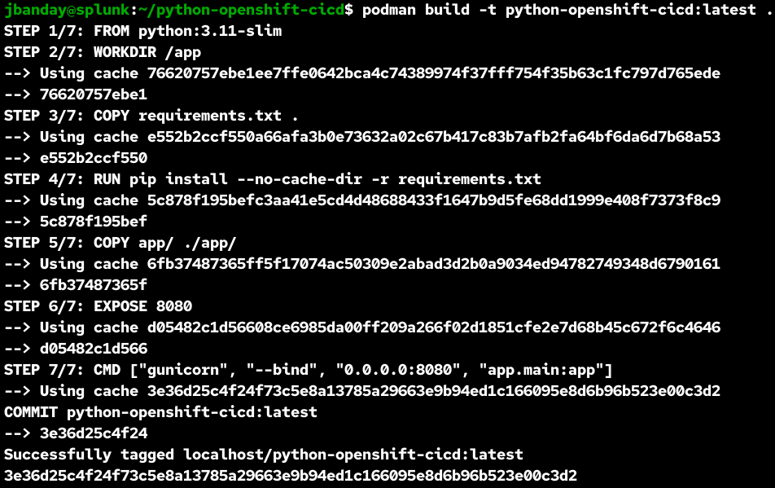
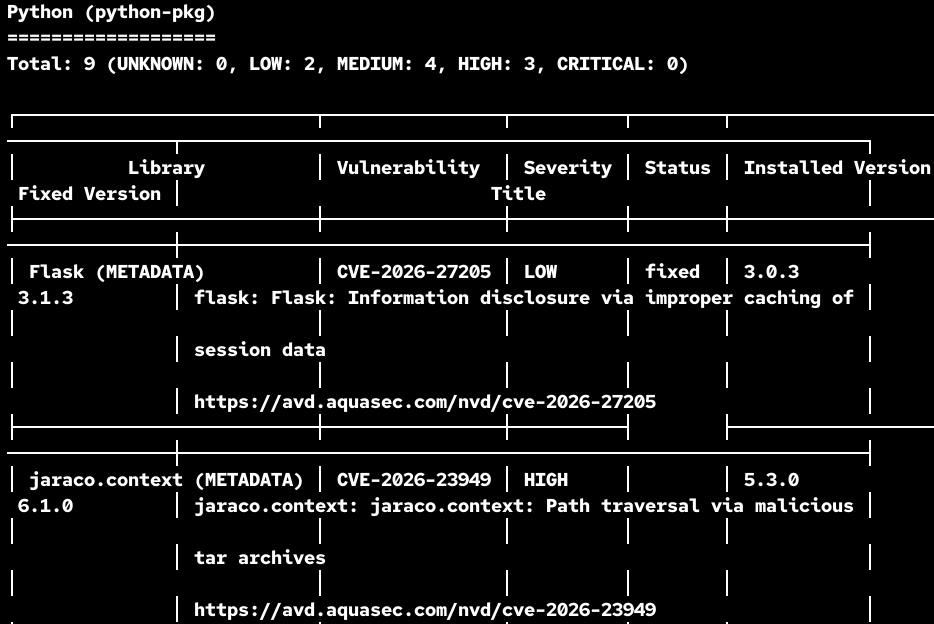
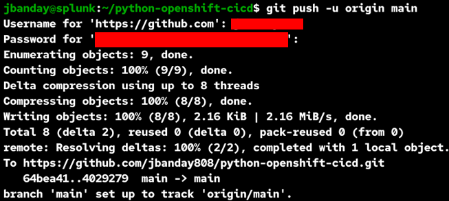
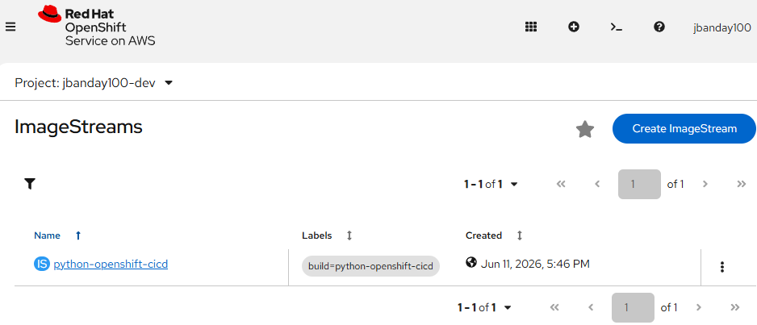
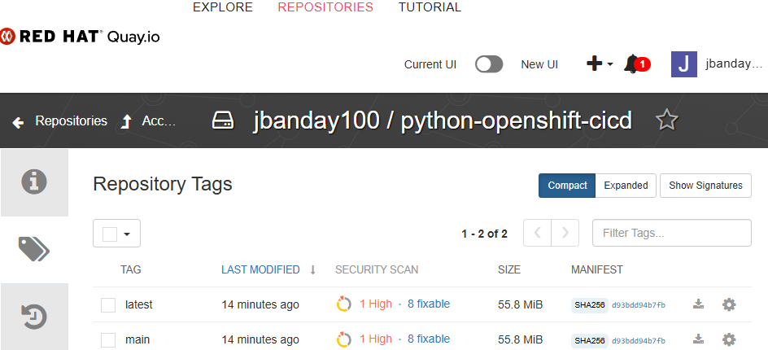
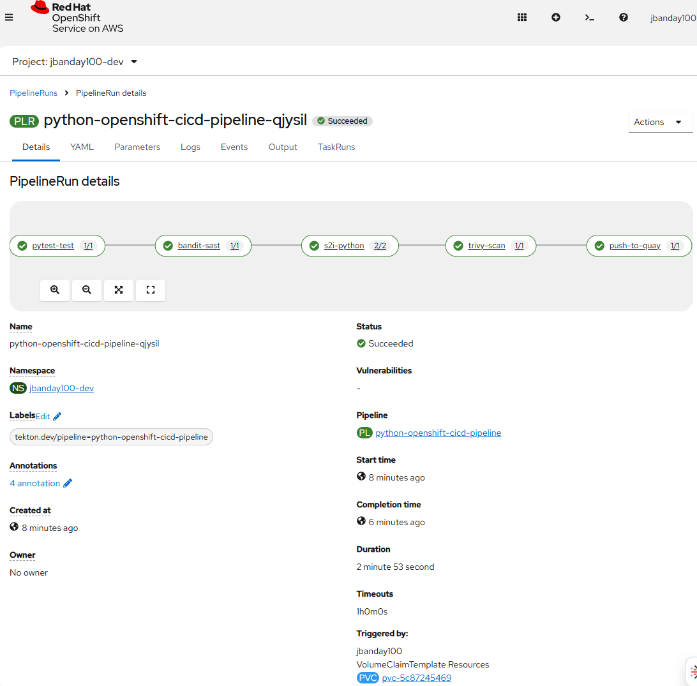
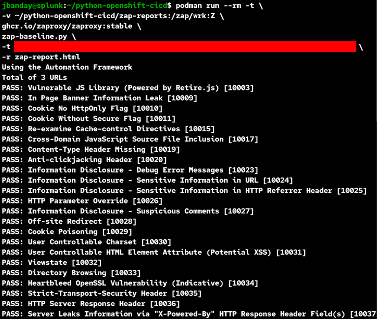

# Python OpenShift CI/CD Pipeline with SAST, DAST, Trivy, Git OAuth

---

## Overview

This project demonstrates a complete DevSecOps CI/CD pipeline for deploying a Python Flask application to Red Hat OpenShift.

The pipeline automates source control, unit testing, security scanning, container image building, image publishing, OpenShift deployment, and live application security testing.

---

## Project Summary

This project shows how a Python application can move securely from source code to a running OpenShift application through a repeatable CI/CD workflow.

The pipeline includes:

* GitHub source control
* Git OAuth authentication
* Pytest unit testing
* Bandit SAST scanning
* Podman container image build
* Trivy vulnerability scanning
* Quay image registry
* OpenShift deployment
* OWASP ZAP DAST scanning

---

## CI/CD Architecture

### Figure 1: Python OpenShift CI/CD Pipeline Architecture



**Figure 1.** High-level architecture showing the automated workflow from GitHub source code through testing, security scanning, container image creation, OpenShift deployment, and OWASP ZAP validation.

---

## Pipeline Flow

```text
GitHub Repository
        |
        v
Git OAuth Authentication
        |
        v
OpenShift Tekton Pipeline
        |
        v
Pytest Unit Testing
        |
        v
Bandit SAST Scan
        |
        v
Container Image Build
        |
        v
Trivy Vulnerability Scan
        |
        v
Push Image to Quay Registry
        |
        v
Deploy to OpenShift
        |
        v
Expose Application with OpenShift Route
        |
        v
OWASP ZAP DAST Scan
        |
        v
Production Application
```

---

## Technology Stack

| Category          | Technology                   |
| ----------------- | ---------------------------- |
| Language          | Python 3.11                  |
| Framework         | Flask                        |
| Testing           | Pytest                       |
| SAST              | Bandit                       |
| Container Runtime | Podman                       |
| Container Build   | Dockerfile                   |
| Image Registry    | Quay.io                      |
| Image Security    | Trivy                        |
| CI/CD             | Tekton / OpenShift Pipelines |
| Platform          | Red Hat OpenShift            |
| DAST              | OWASP ZAP                    |
| Authentication    | Git OAuth                    |

---

## Pipeline Stages

| Step | Stage          | Tool                | Purpose                             |
| ---- | -------------- | ------------------- | ----------------------------------- |
| 1    | Source Code    | GitHub              | Stores application code             |
| 2    | Authentication | Git OAuth           | Provides secure access to GitHub    |
| 3    | Unit Testing   | Pytest              | Validates application functionality |
| 4    | SAST           | Bandit              | Scans Python source code            |
| 5    | Image Build    | Podman / Dockerfile | Builds the application image        |
| 6    | Image Scan     | Trivy               | Scans image vulnerabilities         |
| 7    | Registry Push  | Quay                | Stores container image              |
| 8    | Deployment     | OpenShift           | Runs the application                |
| 9    | DAST           | OWASP ZAP           | Tests the live application          |

---

## Repository Structure

```text
python-openshift-cicd/
├── .tekton/
│   └── push.yaml
├── app/
│   ├── __init__.py
│   └── main.py
├── images/
│   ├── bandit-sast-scan.png
│   ├── dast-owasp-zap-scan.png
│   ├── docker-image.png
│   ├── git-push.png
│   ├── image-stream.png
│   ├── openshift-ci-cd-final-deployment.png
│   ├── python-openshift-ci-cd-diagram-02.png
│   ├── quay-repo.png
│   ├── trivy-scan-result.png
│   └── unit-tests-pytest.png
├── manifests/
│   ├── deployment.yaml
│   ├── service.yaml
│   └── route.yaml
├── tests/
│   └── test_app.py
├── zap-reports/
│   └── zap-report.html
├── Dockerfile
├── README.md
├── app.py
├── bandit-report.txt
├── devfile.yaml
├── requirements.txt
└── trivy-report.txt
```

---

## Application Endpoints

| Endpoint   | Description                  |
| ---------- | ---------------------------- |
| `/`        | Displays application status  |
| `/health`  | Health check endpoint        |
| `/version` | Application version endpoint |

---

## Step 1: Clone the Repository

```bash
git clone https://github.com/jbanday808/python-openshift-cicd.git
cd python-openshift-cicd
```

---

## Step 2: Install Dependencies

```bash
pip install -r requirements.txt
```

---

## Step 3: Run Unit Tests with Pytest

```bash
PYTHONPATH=. pytest tests/test_app.py
```

### Figure 2: Unit Testing with Pytest



**Figure 2.** Pytest validates application functionality and confirms the code passes automated unit testing before entering the deployment pipeline.

---

## Step 4: Run SAST Scan with Bandit

```bash
python3 -m bandit -r app
```

Generate a report:

```bash
python3 -m bandit -r app -f txt -o bandit-report.txt
```

### Figure 3: Bandit SAST Scan



**Figure 3.** Bandit performs Static Application Security Testing to identify insecure coding practices in the Python source code.

---

## Step 5: Build the Container Image

```bash
podman build -t python-openshift-cicd:latest .
```

### Figure 4: Container Image Build



**Figure 4.** The Python application is packaged into a container image for consistent deployment across environments.

---

## Step 6: Run the Container Locally

```bash
podman run --rm -p 8080:8080 python-openshift-cicd:latest
```

Test the local container:

```bash
curl http://127.0.0.1:8080/
curl http://127.0.0.1:8080/health
curl http://127.0.0.1:8080/version
```

---

## Step 7: Run Trivy Vulnerability Scan

```bash
trivy image localhost/python-openshift-cicd:latest
```

Generate a report:

```bash
trivy image localhost/python-openshift-cicd:latest > trivy-report.txt
```

### Figure 5: Trivy Vulnerability Scan



**Figure 5.** Trivy scans the container image for known vulnerabilities, exposed secrets, and insecure packages before deployment.

---

## Step 8: Push Project to GitHub

```bash
git add .
git commit -m "Add Python OpenShift CI/CD project files"
git push -u origin main
```

### Figure 6: Git Push to GitHub



**Figure 6.** Application source code and configuration files are committed and pushed to GitHub as the central source control repository.

---

## Step 9: Deploy to OpenShift

Create the OpenShift build:

```bash
oc new-build \
--name=python-openshift-cicd \
--binary \
--strategy=docker
```

Start the build:

```bash
oc start-build python-openshift-cicd \
--from-dir=. \
--follow
```

Create the application:

```bash
oc new-app python-openshift-cicd
```

Expose the service:

```bash
oc expose svc/python-openshift-cicd
```

---

## Step 10: Verify OpenShift Deployment

```bash
oc get deployment
oc get pods
oc get route
```

Test the route:

```bash
curl http://<openshift-route>/
curl http://<openshift-route>/health
curl http://<openshift-route>/version
```

### Figure 7: OpenShift ImageStream



**Figure 7.** OpenShift ImageStreams manage container image versions and provide image tracking for application deployments.

---

## Step 11: Configure Quay Registry

Create a Quay repository for the application container image.

### Figure 8: Quay Registry Repository



**Figure 8.** Quay serves as the secure container registry used to store and distribute application container images.

Create an OpenShift secret for Quay authentication:

```bash
oc create secret docker-registry quay-secret \
--docker-server=quay.io \
--docker-username='<QUAY_ROBOT_USERNAME>' \
--docker-password='<QUAY_ROBOT_TOKEN>' \
--docker-email='<EMAIL_ADDRESS>'
```

Link the secret to the pipeline service account:

```bash
oc secrets link pipeline quay-secret --for=pull,mount
```

Verify the service account:

```bash
oc describe sa pipeline
```

---

## Step 12: Create Pytest Tekton Task

Create `pytest-task.yaml`:

```yaml
apiVersion: tekton.dev/v1
kind: Task
metadata:
  name: pytest-test
spec:
  workspaces:
    - name: source
  steps:
    - name: pytest
      image: python:3.11-slim
      script: |
        cd $(workspaces.source.path)
        pip install -r requirements.txt
        PYTHONPATH=. pytest tests/test_app.py
```

Apply the task:

```bash
oc apply -f pytest-task.yaml
```

---

## Step 13: Create Bandit SAST Tekton Task

Create `bandit-task.yaml`:

```yaml
apiVersion: tekton.dev/v1
kind: Task
metadata:
  name: bandit-sast
spec:
  workspaces:
    - name: source
  steps:
    - name: bandit
      image: python:3.11-slim
      script: |
        cd $(workspaces.source.path)
        pip install bandit
        bandit -r app || true
```

Apply the task:

```bash
oc apply -f bandit-task.yaml
```

---

## Step 14: Create Trivy Tekton Task

Create `trivy-task.yaml`:

```yaml
apiVersion: tekton.dev/v1
kind: Task
metadata:
  name: trivy-scan
spec:
  workspaces:
    - name: source
  steps:
    - name: trivy
      image: aquasec/trivy:latest
      script: |
        trivy image \
        image-registry.openshift-image-registry.svc:5000/<namespace>/python-openshift-cicd:latest \
        --severity HIGH,CRITICAL \
        --exit-code 0
```

Apply the task:

```bash
oc apply -f trivy-task.yaml
```

---

## Step 15: Create Push-to-Quay Tekton Task

Create `quay-push-task.yaml`:

```yaml
apiVersion: tekton.dev/v1
kind: Task
metadata:
  name: push-to-quay
spec:
  steps:
    - name: copy-image
      image: quay.io/skopeo/stable:latest
      script: |
        #!/bin/sh
        set -e

        TOKEN=$(cat /var/run/secrets/kubernetes.io/serviceaccount/token)

        skopeo copy \
          --src-tls-verify=false \
          --src-creds="unused:${TOKEN}" \
          --dest-creds="<QUAY_ROBOT_USERNAME>:<QUAY_ROBOT_TOKEN>" \
          docker://image-registry.openshift-image-registry.svc:5000/<namespace>/python-openshift-cicd:latest \
          docker://quay.io/<quay-username>/python-openshift-cicd:latest
```

Apply the task:

```bash
oc apply -f quay-push-task.yaml
```

Verify:

```bash
oc get task push-to-quay
```

---

## Step 16: Create Full Tekton Pipeline

Create `python-openshift-cicd-pipeline.yaml`:

```yaml
apiVersion: tekton.dev/v1
kind: Pipeline
metadata:
  name: python-openshift-cicd-pipeline
spec:
  workspaces:
    - name: shared-workspace
    - name: ssh-directory
      optional: true

  tasks:
    - name: git-clone
      params:
        - name: URL
          value: https://github.com/jbanday808/python-openshift-cicd.git
        - name: REVISION
          value: main
        - name: DELETE_EXISTING
          value: "true"
      taskRef:
        resolver: cluster
        params:
          - name: kind
            value: task
          - name: name
            value: git-clone
          - name: namespace
            value: openshift-pipelines
      workspaces:
        - name: output
          workspace: shared-workspace
        - name: ssh-directory
          workspace: ssh-directory

    - name: pytest-test
      runAfter:
        - git-clone
      taskRef:
        kind: Task
        name: pytest-test
      workspaces:
        - name: source
          workspace: shared-workspace

    - name: bandit-sast
      runAfter:
        - pytest-test
      taskRef:
        kind: Task
        name: bandit-sast
      workspaces:
        - name: source
          workspace: shared-workspace

    - name: s2i-python
      runAfter:
        - bandit-sast
      params:
        - name: IMAGE
          value: image-registry.openshift-image-registry.svc:5000/<namespace>/python-openshift-cicd:latest
        - name: VERSION
          value: 3.9-ubi8
        - name: CONTEXT
          value: .
        - name: STORAGE_DRIVER
          value: vfs
        - name: FORMAT
          value: oci
        - name: SKIP_PUSH
          value: "false"
        - name: TLS_VERIFY
          value: "true"
      taskRef:
        resolver: cluster
        params:
          - name: kind
            value: task
          - name: name
            value: s2i-python
          - name: namespace
            value: openshift-pipelines
      workspaces:
        - name: source
          workspace: shared-workspace

    - name: trivy-scan
      runAfter:
        - s2i-python
      taskRef:
        kind: Task
        name: trivy-scan
      workspaces:
        - name: source
          workspace: shared-workspace

    - name: push-to-quay
      runAfter:
        - trivy-scan
      taskRef:
        kind: Task
        name: push-to-quay
```

Apply the pipeline:

```bash
oc apply -f python-openshift-cicd-pipeline.yaml
```

---

## Step 17: Create PipelineRun

Create `pipelinerun.yaml`:

```yaml
apiVersion: tekton.dev/v1
kind: PipelineRun
metadata:
  generateName: python-openshift-cicd-run-
spec:
  pipelineRef:
    name: python-openshift-cicd-pipeline
  taskRunTemplate:
    serviceAccountName: pipeline
  workspaces:
    - name: shared-workspace
      volumeClaimTemplate:
        spec:
          accessModes:
            - ReadWriteOnce
          resources:
            requests:
              storage: 1Gi
```

Run the pipeline:

```bash
oc create -f pipelinerun.yaml
```

---

## Step 18: Verify PipelineRun

```bash
oc get pipelinerun
oc get taskrun
oc get pods
```

View logs:

```bash
tkn pipelinerun logs -f <pipelinerun-name>
```

### Figure 9: OpenShift Final Deployment



**Figure 9.** The Python application is successfully deployed and running in OpenShift, demonstrating a completed CI/CD workflow.

---

## Step 19: Run OWASP ZAP DAST Scan

Create the report directory:

```bash
mkdir -p zap-reports
```

Run OWASP ZAP:

```bash
podman run --rm -t \
-v $(pwd)/zap-reports:/zap/wrk:Z \
ghcr.io/zaproxy/zaproxy:stable \
zap-baseline.py \
-t http://<openshift-route> \
-r zap-report.html
```

### Figure 10: OWASP ZAP DAST Scan



**Figure 10.** OWASP ZAP performs Dynamic Application Security Testing against the live application to identify runtime security risks.

---

## Step 20: Final Validation

Verify deployment:

```bash
oc get deployment
oc get route
oc get pods
```

Verify Quay image:

```bash
skopeo inspect docker://quay.io/<quay-username>/python-openshift-cicd:latest
```

Verify app route:

```bash
curl http://<openshift-route>/
curl http://<openshift-route>/health
curl http://<openshift-route>/version
```

---

## Security Controls

| Security Layer       | Tool      | Purpose                                |
| -------------------- | --------- | -------------------------------------- |
| Unit Testing         | Pytest    | Validates code functionality           |
| Source Code Security | Bandit    | Finds insecure Python code             |
| Container Security   | Trivy     | Finds CVEs and package vulnerabilities |
| Registry Security    | Quay      | Stores approved container images       |
| Runtime Security     | OWASP ZAP | Scans the live application             |
| Platform Security    | OpenShift | Runs and manages workloads             |

---

## Skills Demonstrated

* DevSecOps
* CI/CD pipeline automation
* OpenShift administration
* Kubernetes fundamentals
* Containerization
* Python development
* Git source control
* Security automation
* Vulnerability management
* Troubleshooting and debugging
* Secure Software Development Lifecycle

---

## Results

This project successfully demonstrates:

* Python Flask application deployment
* OpenShift application hosting
* Tekton CI/CD automation
* Pytest unit testing
* Bandit SAST scanning
* Trivy vulnerability scanning
* Quay registry integration
* OWASP ZAP DAST scanning
* End-to-end DevSecOps workflow

---

## Troubleshooting Commands

Check current project:

```bash
oc project
```

Check deployment:

```bash
oc get deployment
```

Check pods:

```bash
oc get pods
```

Check route:

```bash
oc get route
```

Check services:

```bash
oc get svc
```

Check pipeline runs:

```bash
oc get pipelinerun
```

Check task runs:

```bash
oc get taskrun
```

View pod logs:

```bash
oc logs <pod-name>
```

Describe pod:

```bash
oc describe pod <pod-name>
```

---

## Future Enhancements

* Add GitHub webhook trigger
* Add SonarQube code quality scanning
* Add Helm chart deployment
* Add automated rollback
* Add Slack or Teams notifications
* Add multi-environment deployment
* Add OpenShift GitOps / Argo CD in ROSA or a full OpenShift cluster

---

## References

### GitHub Documentation

Reference:
GitHub Docs: Provides guidance for source control management, repository administration, authentication, and collaboration workflows.

https://docs.github.com

---

### Flask Documentation

Reference:
Flask Documentation: Provides guidance for building Python web applications.

https://flask.palletsprojects.com

---

### Pytest Documentation

Reference:
Pytest Documentation: Provides instructions for creating and running automated Python tests.

https://docs.pytest.org

---

### Bandit Documentation

Reference:
Bandit Documentation: Provides guidance for Static Application Security Testing on Python source code.

https://bandit.readthedocs.io

---

### Podman Documentation

Reference:
Podman Documentation: Provides instructions for building, running, and managing containers.

https://podman.io

---

### Trivy Documentation

Reference:
Trivy Documentation: Provides guidance for vulnerability scanning of container images.

https://trivy.dev

---

### Quay Documentation

Reference:
Red Hat Quay Documentation: Provides instructions for managing container image repositories and registry authentication.

https://docs.projectquay.io

---

### OpenShift Documentation

Reference:
Red Hat OpenShift Documentation: Provides guidance for deploying, managing, and troubleshooting applications on OpenShift.

https://docs.openshift.com

---

### OpenShift Pipelines Documentation

Reference:
OpenShift Pipelines Documentation: Provides instructions for implementing CI/CD pipelines using Tekton.

https://docs.openshift.com/container-platform/latest/cicd/pipelines

---

### Tekton Documentation

Reference:
Tekton Documentation: Provides guidance for creating Tasks, Pipelines, PipelineRuns, and CI/CD workflows.

https://tekton.dev/docs

---

### OWASP ZAP Documentation

Reference:
OWASP ZAP Documentation: Provides guidance for Dynamic Application Security Testing of running web applications.

https://www.zaproxy.org/docs

---

### Kubernetes Documentation

Reference:
Kubernetes Documentation: Provides guidance for managing containerized workloads and services.

https://kubernetes.io/docs

---

## Author

James Banday

GitHub:
[https://github.com/jbanday808
](https://github.com/jbanday808/python-openshift-cicd/edit/main)
LinkedIn:
https://www.linkedin.com/in/james-allen-morta-banday-62a391128


---

## License

This project is licensed under the MIT License.
